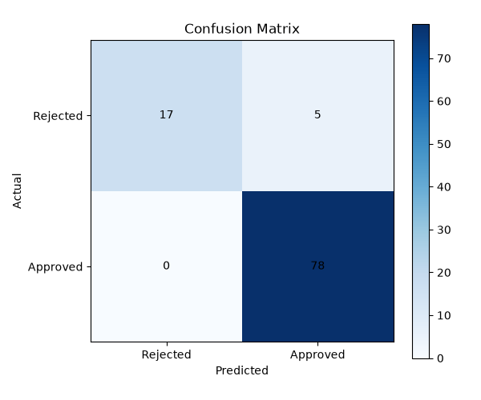

# Loan Approval Prediction Using Random Forest

A Machine Learning project that predicts whether a loan application will be approved or rejected using the Random Forest Classification algorithm.


### Project Overview

This project uses customer and loan application information such as income, loan amount, credit history, education, and property area to predict the loan approval status.

The project includes data preprocessing, categorical data encoding, train-test split, Random Forest model training, model evaluation, confusion matrix visualization, new application prediction, and model saving.


### Technologies UsedPython

- Pandas
- Matplotlib
- Scikit-learn
- Pickle
- Flask


### Machine Learning Algorithm

***Random Forest Classifier***

Random Forest is an Ensemble Learning algorithm that combines multiple Decision Trees to make a final classification prediction.


In this project:

- 100 Decision Trees are used.
- Categorical features are converted into numerical form using One-Hot Encoding.
- The dataset is divided into training and testing data.
- The model predicts whether a loan is Approved or Rejected.
- The trained model is saved using Pickle.


### Data Preprocessing

- Check dataset shape
- Check missing values
- Remove missing rows
- Check and remove duplicate rows
- Convert categorical columns using ```pd.get_dummies()```
- Convert Loan Status: ```Y``` = Approved and ```N``` = Rejected

### Model Evaluation

The model is evaluated using:

- Accuracy
- Confusion Matrix
- Classification Report

### Confusion Matrix

The confusion matrix shows the correct and incorrect predictions made by the model.


